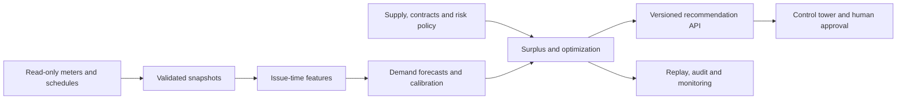

# Mini Project / PoC Specification

Status: proposed design, 17 September 2026. Intended owner: one engineer, supported by an operations sponsor and a commercial reviewer. Planning estimate: 6–8 full-time-equivalent engineering weeks; part-time execution takes longer. Targets below must be agreed before evaluating the final holdout.

## 1. Product definition

**Industrial Estate Energy Surplus Challenge** is a next-day planning service that predicts demand, quantifies uncertainty, and recommends procurement and capacity actions with traceable financial and reliability consequences.

The first business hypothesis is that uncertainty-aware planning can reduce modeled procurement and emergency purchase costs relative to a fixed planning policy, without worsening the agreed reliability metrics. Whether this translates to actual savings depends on contract flexibility, settlement rules, and production data.

Every recommendation answers: which hour, how many MW and MWh, what action, under which assumptions, what modeled value, what risk, and who must approve it?

| Scope | Deliverable |
|---|---|
| PoC required | 20–50 customers; next-day hourly demand; seasonal baseline and LightGBM; P10/P50/P90; estate uncertainty; surplus and shortage; procurement/internal capacity optimization; replay; scenarios; dashboard; audit records |
| Production pilot | Actual meters and contracts; issue-time weather forecasts; topology validation; secure read-only ingestion; shadow operation; access control; alerts; recovery; approval workflow; commercial eligibility review |
| Optional / future | ESS, external trading, stochastic supply models, XGBoost/deep models, LLM copilot, RAG, multiple horizons, advanced power-flow constraints, digital twin |

The PoC never executes trades or equipment commands. A feasible optimization result is a planning recommendation, not electrical dispatch authorization.

## 2. Two distinct ledgers

**Capacity ledger (MW):** contracted entitlement, physical service limit, forecast usage, eligible reassignment, and remaining headroom. Unused entitlement may have no economic value if it cannot be reassigned or its cost is fixed. Moving entitlement between customers does not reduce aggregate estate demand.

**Energy ledger (MWh):** deliverable generation, nominated purchases, actual demand, storage flows, exports, and curtailment for each interval. Physical surplus requires an energy source; unused service capacity alone is not an energy source.

Never add a factory contract limit to estate generation. Distinguish purchasable grid capacity from already committed energy. Procurement savings count only cancellable or avoidable charges, including relevant fees and penalties.

Commercial eligibility is a versioned input maintained by a responsible reviewer: `allowed`, `prohibited`, or `unknown`, with action type, parties, quantity limit, effective dates, evidence reference, and approver. Unknown disables the affected action. The software does not infer permission from a forecast or a retrieved document. No jurisdiction-specific eligibility finding is made in this specification.

## 3. Decision clock and data contract

Issue one next-day plan at **12:00 estate local time**, forecasting tomorrow 00:00–24:00. This is a 24-interval delivery window, with roughly 12–36 hours of lead time, rather than simply the next 24 hours. Make the cutoff configurable for actual procurement rules. Persist issue time, input availability cutoff, target interval, and lead time separately.

Use UTC for joins and a named local timezone for calendar features and reporting. Preserve source timestamps and resolve duplicate/missing daylight-saving intervals before aggregating. BDG2 sites retain their own source calendar; presenting monetary scenarios in THB does not turn their weather and holidays into Thai observations.

| Entity | Required fields and conventions |
|---|---|
| Meter interval | `interval_start_utc`, `interval_end_utc`, `factory_id`, `electricity_kwh`, `quality_flag`, `ingested_at`; unique customer/interval |
| Feature snapshot | `issue_time`, `target_time`, lag/calendar features, optional weather forecast and `weather_issued_at`, schedule version |
| Supply | `target_time`, `source_id`, `deliverable_mw`, `committed_mwh`, `purchase_limit_mw`, availability status; no duplicate sources |
| Contract/network | effective dates, entitlement MW, service/feeder/transformer limits, reassignment permission, import/export limits |
| Economics/policy | THB/MWh tariffs, nominated volumes, cancellation terms, imbalance costs, reserve MW, risk quantile, eligibility version |
| Recommendation | `run_id`, issue/target time, P10/P50/P90 MW, supply MW, expected surplus MW, signed headroom MW, shortage MW, safe envelope MW, action MW/MWh, value THB, status, reason codes, versions |

For an interval of length `dt_hours`, `average_mw = electricity_kwh / (1000 * dt_hours)` and `energy_mwh = average_mw * dt_hours`. Hourly average load does not reveal subhourly thermal or instantaneous peaks. Do not use it to certify breaker or transformer safety.

## 4. Real-data plan

Use **BDG2 electricity meters**, initially 20 customers and then up to 50 after profiling. BDG2 contains hourly measurements for 2016–2017 across non-residential buildings and multiple meter types. Select electricity explicitly; retain building and site metadata. Prefer one site with enough usable meters; otherwise define separate virtual estates by site. Do not combine unrelated local clocks as if they shared a physical network. See the [official repository](https://github.com/buds-lab/building-data-genome-project-2) and [dataset paper](https://doi.org/10.1038/s41597-020-00712-x).

Archive the upstream revision, file checksums, license/attribution, meter selection, and exclusion reasons. Use raw measurements with auditable cleaning; inspect the provided cleaned version before adopting it because removal of zero runs can remove genuine shutdown behavior. Selection criteria use the development period only, preventing a future-completeness filter from favoring easy holdout meters.

Proposed quality gate: at least 95% valid development intervals per selected meter, resolved units and timezone, and no unexplained duplicate keys. Record valid-zero, missing, outage, and suspicious readings separately. Fit imputation on past data only; never interpolate using future values. Do not impute evaluation labels for scoring. Report score availability and missingness by customer and season. An incomplete aggregate label is not a complete estate observation.

Real fields: consumption, source metadata, and available historical weather. Synthetic fields: contracts, deliverable supply schedules, commercial eligibility, THB tariffs, feeder topology, production schedules, reserve, and ESS parameters. Store these in separate tables with `provenance=observed|derived|synthetic` and a fixed random seed where used. Fit any demand-based synthetic sizing rules on training data only; freeze them before replay.

Historical observed weather is not a weather forecast available at issue time. The scored MVP uses calendar and demand history; a weather extension needs archived issue-time forecasts or a clearly labeled sensitivity experiment. Do not advertise observed future weather results as deployable accuracy. ASHRAE is an alternative source, not an independent validation set assumed disjoint from BDG2.

## 5. Forecasting and ML learning design

Start with weekly Seasonal Naive (`target - 168 hours`) and daily seasonal persistence where the source observation is available at the cutoff. Add a pooled LightGBM point model with factory/site identifiers, calendar features, and issue-time demand history. Pooling shares statistical strength across customers without maintaining dozens of independent model pipelines.

Use a direct multi-horizon supervised table: one row per issue time, customer, and target hour, with lead time as a feature. Historical rolling windows end at the input cutoff. For target-relative `lag_24h` or `lag_1h`, verify that the source timestamp predates the cutoff; later horizons may make those unavailable. Mask unavailable features or use origin-relative lags. Run an explicit availability assertion during feature generation.

Fit quantile models at 0.1, 0.5, and 0.9. LightGBM supports the quantile objective and its `alpha` parameter; see [official parameters](https://lightgbm.readthedocs.io/en/latest/Parameters.html). Quantile loss targets the asymmetry between over- and underprediction and avoids assuming normally distributed errors. Nonnegative clipping and quantile ordering must be applied consistently before calibration and evaluation.

Proposed chronological protocol:

1. Develop with expanding-window folds within January 2016–June 2017. Include different seasons; fit preprocessing independently per fold.
2. Freeze features and hyperparameters, then fit the candidate on that development period.
3. Use July–September 2017 for residual/quantile calibration and policy selection. Report seasonal limitations explicitly.
4. Keep October–December 2017 untouched for final daily issue-time replay. Model and calibration artifacts remain frozen; newly observed demand may update input history, as it would operationally.

Quantile calibration uses out-of-sample residuals, with pooled estimates if hour/customer samples are too sparse. Temporal dependence and seasonal change limit coverage claims. Report empirical coverage and uncertainty using day/block resampling rather than treating all customer-hours as independent.

**Hierarchy:** factory quantiles cannot be summed to obtain estate quantiles. For the MVP, retain factory marginal P10/P50/P90 and separately forecast/calibrate the observed estate total. Present any point-forecast discrepancy, rather than silently claiming coherence. The next milestone samples aligned customer residual vectors in whole-day blocks, preserving cross-customer and temporal dependence, then sums each sample to form estate trajectories. Every scenario is coherent; marginal medians still need not add. Evaluate the resulting aggregate quantiles before replacing the independently calibrated estate model. If coherent point forecasts are required, use nonnegative reconciled point predictions and label them as point predictions, not automatically as medians.

Explain high demand with observed schedules, calendar comparisons, and optional tree SHAP. Feature attribution describes model behavior, not causal evidence. XGBoost is an optional challenger; N-HiTS/TFT require demonstrated incremental value before their training and maintenance complexity is justified.

## 6. Risk policy and safe surplus

For deterministic deliverable supply `S_t`, demand median `D50_t`, risk quantile `Dq_t`, and operational reserve `R_t`:

```text
expected_surplus_mw[t] = S[t] - D50[t]
signed_headroom_mw[t] = S[t] - Dq[t] - R[t]
safe_envelope_mw[t] = max(0, signed_headroom_mw[t])
shortage_mw[t] = max(0, -signed_headroom_mw[t])
```

Display both shortage and nonnegative envelope; clipping must not hide a deficit. `S_t` means physically deliverable supply under the scenario, not nameplate capacity or the sum of customer contracts. Flexible purchases are an optimizer decision and cannot be counted as free pre-existing surplus. For Case A, label the result supply headroom or avoidable procurement; reserve the physical surplus label for the energy ledger.

Example for one hour: 100 MW supply − 89 MW P90 demand − 3 MW operating reserve = 8 MW envelope. In an explicitly export-eligible scenario, allocate 5 MW export, 2 MW charging, and 1 MW additional uncommitted headroom. This reconciles `89 + 3 + 5 + 2 + 1 = 100`. The 1 MW is additional headroom, not the already deducted 3 MW reserve. Export energy is 5 MWh for that hour.

**P90 is not a 90% guarantee that all tomorrow's hours are safe.** It is a marginal demand quantile if calibrated; a 24-hour joint event is different, and reserve alters the actual exceedance threshold. Report hourly envelope breaches and days with any breach. Actual production risk policy must be chosen with the operator; the PoC compares P90 with a more conservative threshold and reserve sensitivity, without claiming certification.

For uncertain generation, model joint net-load scenarios and evaluate lower-tail surplus after reserve. Separately choosing low supply and high demand quantiles does not establish a calibrated joint confidence level. Weather-driven supply, load correlation, contingencies, and reserve deliverability need explicit treatment before a production trading claim.

## 7. Optimization design

Use a linear program for fixed-topology procurement planning, with a separate capacity-entitlement allocation layer. Suggested implementation: a Python modeling interface backed by an open-source LP solver. A mixed-integer extension is appropriate for battery mode exclusivity or discontinuous commercial terms.

For each hour, minimize total controllable purchase cost + emergency purchase cost + cancellation/imbalance penalties + optional storage degradation − eligible export revenue. Omit fixed costs that do not change between policies, but include them in total business reporting when relevant.

Physical variables include import `b`, export `x`, utilized generation `g`, curtailment, and optional charge `c` / discharge `d`; all power variables are MW. Bound `g` by available generation and account for curtailment. For the selected planning demand `Dq`:

```text
g[t] + b[t] + d[t] = Dq[t] + c[t] + x[t]
0 <= b[t] <= import_limit[t]
0 <= x[t] <= eligible_export_limit[t]
```

Represent reserve as unused deliverable source capability, with source-specific bounds and network access. Imports can provide reserve only if spare import capacity is contractually callable. Reserved generation capacity cannot also be dispatched. Cap exports and charging by the separately computed safe allocation envelope when they draw on committed supply; disallow purchasing for resale unless explicitly permitted. Enforce feeder balances, thermal planning limits, service limits, and transfer eligibility. A simplified radial network with fixed loss assumptions is sufficient for the PoC; it is not an AC power-flow validation.

The capacity layer assigns permitted entitlement transfers `a[i,j,t]`, bounded by donor headroom, receiver need, agreement limits, and network feasibility. Transferred amounts cancel at estate level. Do not book procurement savings for entitlement transfer unless it changes a priced charge or avoids a documented purchase/penalty.

For the optional battery:

```text
soc_mwh[t+1] = soc_mwh[t]
              + eta_charge * c[t] * dt_hours
              - d[t] * dt_hours / eta_discharge
```

Enforce SOC minimum/maximum, initial SOC, power limits, a terminal SOC policy, and no simultaneous charge/discharge. Prevent unsupported simultaneous import/export. Battery reserve also requires adequate SOC and sustained discharge duration; MW alone is insufficient. Compare policies from the same initial and terminal battery conditions to avoid fake profits from draining initial inventory.

Solve a nominal plan and then replay it against actual demand with the same predefined emergency procurement and imbalance rules as the baseline. Record reserve violations, emergency energy, and unmet energy explicitly. Infeasibility returns a diagnostic and operator alert, not a zero-filled success. Solver timeouts or invalid inputs suppress actionable recommendations.

## 8. Backtest, value, and acceptance

Compare on identical inputs and commercial assumptions:

- Fixed operational baseline: weekly seasonal demand plus fixed reserve and fixed procurement rules.
- Point-forecast policy: LightGBM demand plus the same reserve.
- Risk-aware policy: calibrated quantile demand and optimization.
- Optional perfect-information result: an explicitly unattainable upper bound, never a deployable baseline.

Freeze rules before the final holdout; stress tariffs, flexible procurement shares, reserve, and imbalance costs. Report negative savings as well as positive ones.

| Measure | Proposed PoC acceptance / reporting |
|---|---|
| Estate WAPE | At least 10% relative improvement over Seasonal Naive on untouched holdout; report MAE/RMSE and factory distribution too |
| Peak error | Report daily peak magnitude error, peak timing error, and underprediction tail; no deterioration in peak MAE against baseline |
| P90 coverage | Target 87–93% overall empirical coverage, with day-block interval and hour/customer slices; inadequate sample sizes are disclosed |
| Quantile quality | Pinball loss and interval width alongside coverage, so trivially broad intervals do not win |
| Decision reliability | Zero modeled hard-constraint violations in accepted plans; no increase in replay unmet-energy MWh or days with unmet demand versus baseline |
| Risk diagnostics | Emergency purchase MWh, reserve breach hours and days, tail loss, false opportunity alerts, and warning lead time |
| Economic result | Proposed gate: at least 3% reduction in controllable replay cost in the preregistered base scenario, with sensitivity and uncertainty; this is not realized ROI |
| Runtime | Daily end-to-end planning under 5 minutes for 50 customers on a documented CPU host; record actual measurements |
| Traceability | Every displayed recommendation resolves to data/model/policy versions, quantities, costs, and reason codes |
| Failure behavior | Stale inputs, outage, infeasible optimization, and service failure visibly suppress approval and invoke fallback |

WAPE is `sum(abs(actual - forecast)) / sum(actual)` on valid labeled intervals; report undefined denominators rather than substituting a favorable score. MAPE is secondary because near-zero demand distorts it. Anomaly precision/recall waits until labeled anomaly work is in scope. Hourly evaluation cannot establish subhourly supply reliability.

Financial value is `baseline realized replay cost - recommended policy realized replay cost`, including recourse and applicable fees. Split procurement savings, entitlement charge savings, external net revenue, and storage value; avoid counting the same MWh twice. Report value relative to total cost and controllable cost with denominators.

Illustration only: reducing an actually cancellable purchase by 4 MW for 3 hours avoids 12 MWh. At a synthetic THB 2,500/MWh, gross avoided spend is THB 30,000; cancellation charges and subsequent imbalance purchases reduce it. Do not multiply unused MW by a tariff per MWh without duration, or present fixed contract charges as avoided spend.

Do not annualize one attractive day. Estimate annual benefit only after representative seasonal evidence and deduct software, infrastructure, labor, support, and approval costs. Report separately: simulated opportunity, approved opportunity, executed action, and verified realized savings.

## 9. Engineering architecture



PoC stack: Python, Pandas or Polars, Parquet, LightGBM, LP solver, FastAPI, and a small Streamlit dashboard. Use one scheduled batch job and one read-only API; notebooks call the same tested Python modules. Track experiments with MLflow locally, or a minimal immutable run manifest initially. Docker and GitLab CI package and validate the pipeline. Start with files; add PostgreSQL for multiuser approval/audit state when needed. No Kafka, Kubernetes, Redis, vector database, or feature store is required for the first release.

Proposed API contracts: `GET /runs/{id}/forecast`, `GET /runs/{id}/recommendations`, `GET /runs/{id}/explanations`, and later authenticated `POST /recommendations/{id}/approval`. Approval binds to immutable recommendation and policy versions, expires at the operational cutoff, and does not itself execute anything. Revised recommendations require renewed approval.

Every run manifest records input checksums, availability cutoff, selected meters, Git commit, environment lock, feature schema, model/calibration artifacts, policy version, scenario, solver status, and output checksum. Retrying an identical issue-time run uses an idempotency key; changing inputs creates a new version.

Production evolution: read-only OT gateway into an IT data zone; service identities, secrets management, RBAC, immutable audit retention, backups and restore drills, model promotion/rollback, centralized observability, and separate approval/execution integration. Cloud, on-prem, and hybrid all support this batch architecture. Data leaves the company only through explicitly configured flows; local deployment does not require an external LLM.

Monitor data freshness/completeness, schema and feature drift, delayed accuracy/coverage, opportunity breaches, optimizer feasibility, solver latency, and approval outcomes. Drift triggers investigation or candidate retraining, not automatic promotion. A challenger must pass chronological and business-policy replay gates before replacing the champion.

Fallback order: retain an unexpired approved plan only if its supply and safety assumptions remain valid; otherwise use the operator-approved conservative planning policy with current verified inputs. Seasonal Naive is available for model failure but is not safe when the input data itself is missing. Suppress new sale/reallocation advice and request manual planning when supply, critical meters, or constraints are unverified. Provisional PoC meter freshness limit is 2 hours at issue time; production thresholds come from operating requirements.

## 10. Scenarios and demonstration

| Scenario | Input change | Required demonstration |
|---|---|---|
| Normal | Base observed history and synthetic supply/economics | Forecast band, envelope, recommendation, baseline comparison |
| Hot day | Weather forecast +5°C, if a weather-aware model exists | Recompute and flag out-of-distribution inputs; do not guarantee learned demand increases |
| Factory shutdown | Explicit factory demand override to zero | Recompute aggregate, uncertainty assumptions, and allocation; distinguish confirmed shutdown from missing meter |
| Production surge | Factory C demand path ×1.30 | Recompute risk and feasible actions; label as stress assumption, not a learned causal response |
| Supply reduction | Deliverable supply ×0.85 | Reduce allocation, expose shortage/import limits, and suppress sale when infeasible |
| Failure injection | Stale data, unknown permission, or solver failure | Visible reason code and no approvable unsafe result |

For the initial no-weather model, the hot-day card is a clearly labeled load sensitivity assumption or disabled. It must not imply temperature affects a model that has no weather features. Recompute from underlying customer trajectories rather than editing estate KPI cards.

The control tower shows issue time, validity, data provenance, estate hourly load band and supply, worst-hour shortage, daily surplus MWh, peak MW, and modeled net value THB. Keep timestamp and aggregation consistent across KPI cards. Separate current consumption, tomorrow peak, and daily opportunity. A cap on purchasable supply is not displayed as owned generation.

Use an explanation waterfall: expected headroom → demand uncertainty deduction → operating reserve deduction → technical envelope → commercial/network caps → allocation. Show external sale as disabled with its reason by default. Template explanations are sufficient; an optional LLM may later verbalize these structured facts with run and document references, and must not invent quantities or permissions.

## 11. Open decisions before production data integration

The PoC can proceed using labeled synthetic assumptions. Before an operational pilot, confirm the estate's owned generation and supply mix, actual meter intervals and timezone, nomination/cancellation windows, tariff and contract flexibility, network topology, permitted internal reassignment, reserve and reliability policy, ESS availability, procurement baseline, and accountable approvers. An operations engineer validates electrical limits; a commercial/legal owner supplies eligibility decisions; finance validates the savings ledger.
